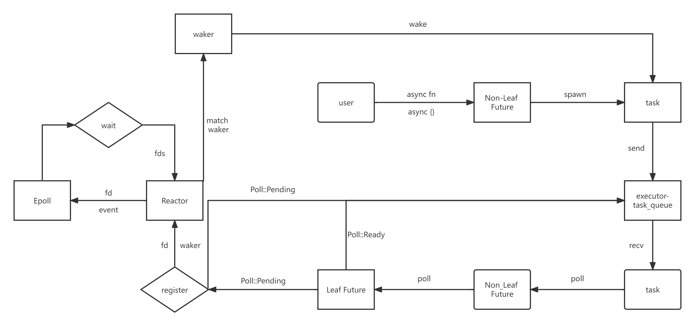

# async-runtime
这是一个简单的单线程异步运行时，实现了异步的网络IO读写操作，是 [async-rust](https://github.com/night-cruise/async-rust) 中 [异步运行时](https://night-cruise.github.io/async-rust/%E5%BC%82%E6%AD%A5%E8%BF%90%E8%A1%8C%E6%97%B6.html) 章节的源代码。




## Usage

克隆：
```
git clone https://github.com/night-cruise/async-runtime.git
```
切换到项目目录：
```
cd async-runtime
```
运行例子：
```
cargo run --example echo_server
```
开启运行后的 `echo server` 会监听地址：`127.0.0.1:8080`

## client
使用 `Python` 写一个小脚本模拟 `TCP` 客户端：
```python
import socket
import threading

HOST = '127.0.0.1'
PORT = 8080


def send_request():
    s = socket.socket(socket.AF_INET, socket.SOCK_STREAM)
    s.connect((HOST, PORT))
    for i in range(1, 1025):
        s.send(f"HELLO WORLD[{i}]".encode())
        data = s.recv(1024).decode()
        print(f"RECEIVE DATA: '{data}' in THREAD[{threading.currentThread().name}]")
    s.close()


def main():
    t_lst = []
    for _ in range(10):
        t = threading.Thread(target=send_request)
        t_lst.append(t)
        t.start()

    for t in t_lst:
        t.join()


if __name__ == '__main__':
    main()
```
运行脚本，服务端会输出以下内容：
```
.....
.....
.....
[src/reactor.rs: 43] (Reactor) wake up. nfd = 2
[src/reactor.rs: 49] (Reactor) delete event: 6
[src/reactor.rs: 49] (Reactor) delete event: 7
[src/reactor.rs: 43] (Reactor) wake up. nfd = 3
[src/reactor.rs: 49] (Reactor) delete event: 9
[src/reactor.rs: 27] (Reactor) add event: 6
[src/reactor.rs: 49] (Reactor) delete event: 10
[src/reactor.rs: 49] (Reactor) delete event: 11
[src/reactor.rs: 43] (Reactor) wake up. nfd = 2
```
客户端的输出内容如下所示：
```
.....
.....
.....
RECEIVE DATA: 'HELLO WORLD[1022]' in THREAD[Thread-3]
RECEIVE DATA: 'HELLO WORLD[1015]' in THREAD[Thread-7]
RECEIVE DATA: 'HELLO WORLD[1013]' in THREAD[Thread-6]
RECEIVE DATA: 'HELLO WORLD[1021]' in THREAD[Thread-1]
RECEIVE DATA: 'HELLO WORLD[1023]' in THREAD[Thread-3]
RECEIVE DATA: 'HELLO WORLD[1008]' in THREAD[Thread-10]
RECEIVE DATA: 'HELLO WORLD[1014]' in THREAD[Thread-6]
RECEIVE DATA: 'HELLO WORLD[1016]' in THREAD[Thread-7]
```
可以看出，我们的 `echo server` 正确地返回了响应，`wake up. nfd = 3` 表示有3个事件同时就绪，这说明 `server` 确实在并发地处理多个请求！


## LISENCE

[CCO](https://creativecommons.org/choose/zero/)
